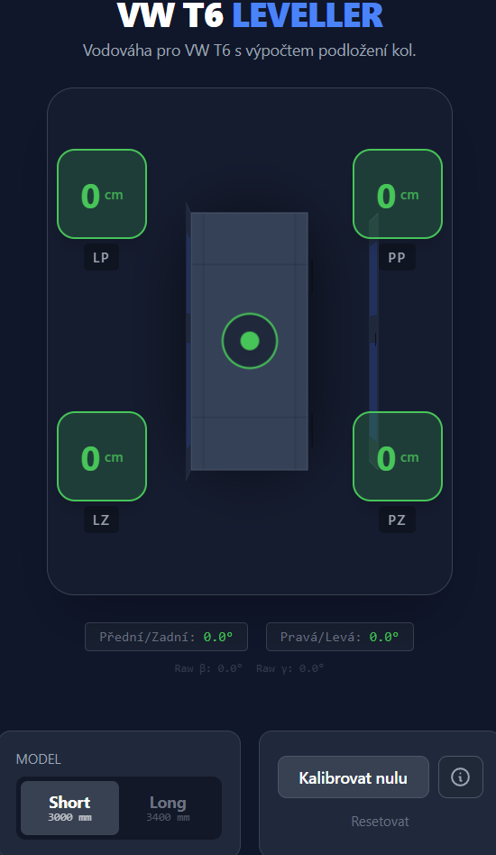

# T6 Leveller

**Level your VW T6 anywhere, anytime – precise, fast, and simple.**

**T6 Leveller** is a simple and practical app designed for VW T5/T6 Multivan, California, and Transporter owners to quickly and accurately level their vehicle while camping or parking on uneven ground.

The app uses your phone's gyroscope and accelerometer to display the vehicle's **pitch** (front/back tilt) and **roll** (left/right tilt) in real-time. This makes it easy to level the van using ramps, leveling blocks, or by finding a flat parking spot.

---

## 🖼️ Screenshot

_Visual representation of vehicle tilt with calculated leveling for each wheel._

---

## 🚐 Features

- Real-time display of vehicle tilt in both axes
- High-sensitivity measurement using device sensors
- Visual tilt indicator for quick reference
- Highlighting when the vehicle is perfectly level
- Support for iOS & Android
- Optional calibration for improved accuracy
- Minimalist, user-friendly interface designed for in-vehicle use
- Low battery consumption

---

## 🧭 How It Works

The app requests access to your device's orientation sensors (DeviceMotion / Gyroscope). Once granted, it streams:

- **roll** – left/right tilt
- **pitch** – forward/backward tilt

These values are displayed visually, helping you level your vehicle precisely.

---

## 🛠️ Tech Stack

- React + Vite
- TypeScript
- DeviceMotion API / Gyroscope API
- Optional: WebKit permissions handling for iOS Safari
- PWA-ready (optional)

---

## 📱 iOS Gyroscope Permissions

To enable the gyroscope on iOS Safari:

Settings → Safari → Advanced → Experimental Features → DeviceMotion → Enabled
